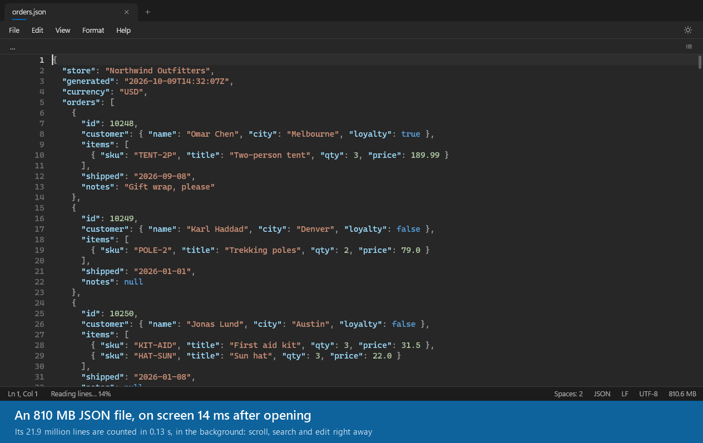
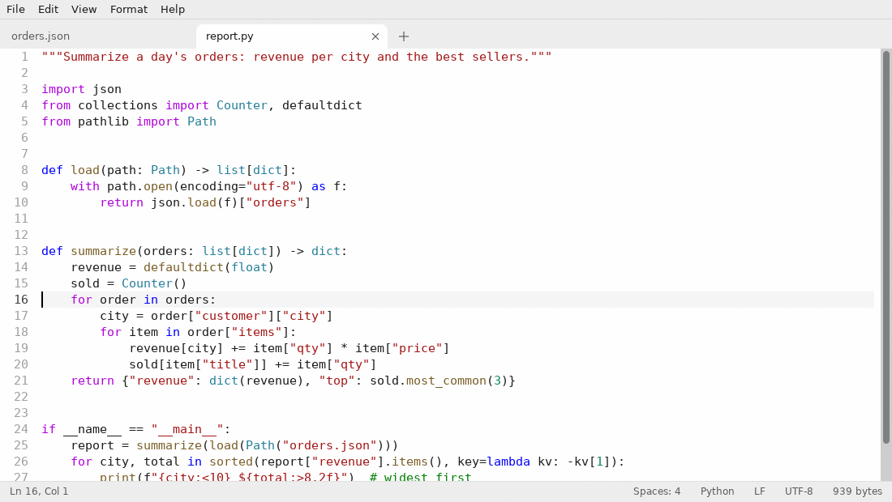

# Slate

[](https://github.com/jamesccupps/Slate/releases/latest)
[](https://github.com/jamesccupps/Slate/actions/workflows/build.yml)
[](LICENSE)

A fast, simple text editor for Windows and Linux (Raspberry Pi included) that opens files of any size: an 800 MB
JSON file opens instantly, scrolls smoothly, and can be searched, edited, formatted and saved.

**[⬇ Download for Windows](https://github.com/jamesccupps/Slate/releases/latest/download/Slate.exe)** (one signed
`Slate.exe`, 64-bit Windows 10 or 11) · **[Linux and Raspberry Pi](#linux-and-raspberry-pi)** (apt) ·
[All releases](https://github.com/jamesccupps/Slate/releases) · [Website](https://jamesccupps.github.io/Slate/)



<sub>Measured on a Windows PC with an NVMe drive, the file already in Windows' memory cache; the 810 MB file is made-up shop orders.</sub>

- Opens huge files instantly: nothing is loaded up front, only what's on screen is read and drawn. Files open in the
  background, so a slow network drive never freezes the window.
- Tabs that come back after a restart, including unsaved changes (like Windows 11 Notepad), for big files too. Work
  is never lost silently: anything that can't be kept is asked about, and Windows won't shut down over it without
  asking.
- Find and replace with match case, whole word and regular expressions; fast on huge files.
- Syntax colors for 52 kinds of files: Python, PowerShell, Batch, Shell, VBScript/VBA, AutoHotkey, Perl, R, C, C++,
  C#, Objective-C and Objective-C++, Java, Kotlin, Scala, Swift, Dart, Go, Rust, JavaScript, TypeScript, PHP, Ruby,
  Lua, SQL, HTML (with its CSS and scripts), CSS, XML, Markdown (code blocks in their language), YAML, JSON, TOML,
  INI, Java properties, nginx and Apache configuration, Terraform/HCL, CMake, Dockerfiles, Inno Setup and NSIS
  installer scripts, G-code (3D printers, CNC), PPCL programs (Siemens APOGEE and Desigo), CSV with commas or
  semicolons and TSV (each column its own color), logs, diffs, subtitles (SRT, WebVTT), calendars and contacts
  (iCalendar, vCard) and Visual Studio solutions. Block comments and multi-line strings are followed correctly.
- Line tools: sort lines (`file2` before `file10`), remove duplicate or blank lines, trim spaces at line ends;
  UPPERCASE / lowercase / Title Case; comment or uncomment lines with Ctrl+/; duplicate, delete and move lines.
- JSON and XML: format (pretty-print), minify and check, also for JSON Lines; a path bar showing where the caret
  is (`data › [1203] › name`, `catalog › book[3] › title`; copy it as a JSON path or XPath) and a structure panel to
  browse objects, arrays and elements, fast on huge files.
- Go to line (`slate notes.txt:120` opens a file at a line), word wrap, line numbers, show whitespace, the matching
  bracket highlighted, overtype, zoom, dark and light themes (follows Windows, or switch with the sun/moon button).
  With Windows' high contrast on, Slate uses its colors, and Magnifier follows the text cursor.
- Reopen closed tabs (Ctrl+Shift+T), close the other, the saved or all tabs, and a list of all tabs when they don't
  fit. The status bar counts words and characters, and shows the language, line endings, encoding and indentation:
  click one to change it.
- Detects and keeps the encoding (UTF-8, UTF-8 with BOM, UTF-16, ANSI) and line endings (CRLF / LF). Saving as ANSI
  asks first if some characters would turn into "?".
- Notices when another program changes an open file; reloads it automatically when you have no unsaved changes
  (handy for log files).
- A single small `Slate.exe` that runs from any folder. *Help → Open files with Slate…* adds it to "Open with",
  the Start menu and the right-click menu; *Help → Stop opening files with Slate…* takes that back. Scripts that
  Windows runs when they're double-clicked (`.bat`, `.cmd`, `.vbs`, `.js`, `.reg`, `.py`…) are left alone: open
  them with *Edit with Slate* on the right-click menu.
- Keeps itself up to date: at most once a day it asks GitHub for the latest release, and when there's a newer one
  an *Update* button appears in the status bar. One click downloads it, checks it against the release's checksum
  (and, from 0.8.1, that it's signed by the same publisher) and restarts Slate with your tabs (and their unsaved text) back where they were. If the new version can't start,
  the old one comes back by itself. *Help → Check for updates* does it on demand.

## Keyboard shortcuts

The usual ones work as in Notepad (Ctrl+N, O, S, F, H, G, Z, Y, A, X, C, V), plus:

| Keys | |
| --- | --- |
| Ctrl+W / Ctrl+Shift+T | Close tab / reopen the tab closed last |
| Ctrl+Tab, Ctrl+1 … Ctrl+9 | Next tab, go to a tab |
| Ctrl+Alt+S | Save all |
| Ctrl+D / Ctrl+Shift+K | Duplicate / delete the line |
| Alt+Up / Alt+Down | Move the line up / down |
| Ctrl+/ | Comment / uncomment the lines |
| Ctrl+U / Ctrl+Shift+U | lowercase / UPPERCASE |
| Shift+Alt+F | Format JSON or XML |
| F3 / Shift+F3 | Next / previous match |
| Alt+Z | Word wrap |
| Ctrl+Plus / Ctrl+Minus / Ctrl+0 | Zoom in / out / reset |
| Ctrl+Shift+O | JSON and XML structure panel |
| F5 | Insert the time and date |

*Help → Keyboard shortcuts* lists them all.

## Download

Get `Slate.exe` from the [latest release](https://github.com/jamesccupps/Slate/releases/latest) and run it from
any folder. It needs 64-bit Windows 10 or 11. `Slate.exe --install` sets it up for your account without asking
anything (what *Help → Open files with Slate…* does, for scripts and package managers).

`Slate.exe` is code-signed (publisher: James Cupps, through Microsoft's Artifact Signing) since 0.8.0. While the
certificate is new, Windows' SmartScreen may still show "Windows protected your PC" the first time; choose *More
info* → *Run anyway*. Each release lists the SHA-256 of `Slate.exe` (in `Slate.exe.sha256`) if you want to check
the download.

### Linux and Raspberry Pi

Slate runs on 64-bit Linux with GTK 4.8 or newer: Debian 12, Raspberry Pi OS 12 (Bookworm, on a Raspberry Pi 4 or
5), Ubuntu 23.04 and newer, or similar. To install it, run these two lines in a terminal; they get the package for
your computer from the latest release:

```
wget -O /tmp/slate.deb https://github.com/jamesccupps/Slate/releases/latest/download/slate-linux-$(dpkg --print-architecture).deb
sudo apt install /tmp/slate.deb
```

Or add Slate's apt repository yourself and install it by name, like any other package:

```
sudo wget -O /usr/share/keyrings/slate-archive-keyring.gpg https://jamesccupps.github.io/Slate/apt/slate-archive-keyring.gpg
echo "deb [signed-by=/usr/share/keyrings/slate-archive-keyring.gpg] https://jamesccupps.github.io/Slate/apt stable main" | sudo tee /etc/apt/sources.list.d/slate.list
sudo apt update && sudo apt install slate
```



Slate is then in the menu (Accessories), opens files from the file manager, and `slate notes.txt` opens a file from
a terminal; **Help → Open files with Slate…** makes it the app that opens text, Markdown, CSV, JSON, XML, YAML, log
and code files when they're double-clicked. The package also adds Slate's own apt repository (signed; `/etc/apt/sources.list.d/slate.list`), so
`sudo apt upgrade` keeps Slate up to date along with the rest of the system; removing Slate removes that too. The
[latest release](https://github.com/jamesccupps/Slate/releases/latest) also has the packages to download yourself
(`slate-linux-arm64.deb` for 64-bit ARM like the Pi, `slate-linux-amd64.deb` for PCs; install one with
`sudo apt install ./slate-linux-arm64.deb`) and `.tar.gz` files with the same program to run without installing
(those don't update). The Linux version has the same engine, colors and editing as on Windows, in a GTK window; it
doesn't have the JSON/XML structure panel and path bar yet. Its settings and session are in `~/.local/share/slate`.

## Where Slate keeps things

- Settings, the session (open tabs and unsaved text) and `crash.log` are in `%LOCALAPPDATA%\Slate`
  (*Help → Open settings folder*). *File → Restore last session* turns the session off: closing then asks about
  unsaved changes, like Notepad used to.
- **Portable mode:** put an empty file named `Slate.portable` next to `Slate.exe`, and Slate keeps all of that, and
  its temporary files, in a `data` folder beside it instead (handy on a USB stick or a fast drive).
- Slate running as administrator keeps its own session, apart from the normal one.

## Updates and privacy

The update check is one request to `api.github.com` for the latest release of this repository; it sends nothing
about you or your files. Turn it off with *Help → Check for updates automatically*. Slate doesn't send anything
else anywhere. If it crashes, it writes `crash.log` (and a small crash dump) in its settings folder, and only
there; *Help → Report a problem…* opens a GitHub issue form with the version filled in, which you can edit and send
yourself, attaching those files if you like.

## Uninstalling

To keep Slate but stop it opening files when they're double-clicked: *Help → Stop opening files with Slate…*; the
file types you set to open with Slate go back to Windows' own choice. To remove it: if you used *Open files with
Slate…*, Windows Settings → Apps → Installed apps → Slate → Uninstall. Then delete
Slate's folder, and `%LOCALAPPDATA%\Slate` (or the portable `data` folder) if you don't need your settings and
unsaved text any more. Otherwise just delete `Slate.exe`.

## License

MIT: see [LICENSE](LICENSE). The libraries built into `Slate.exe` are listed, with their licenses, in
[THIRD-PARTY-NOTICES.md](THIRD-PARTY-NOTICES.md).

## Building

Windows: needs Rust (the GNU toolchain is enough; no Visual Studio). Run `build.cmd`, which produces
`dist\Slate.exe`. Linux: Rust and GTK 4's development files (`sudo apt install build-essential libgtk-4-dev`), then
`cargo build --release` (`target/release/Slate`); `packaging/linux/package.sh` makes the `.deb`.
`cargo test --lib` runs the unit tests, and `Slate.exe --test tests\smoke.txt` drives the real app in a hidden
window (set `SLATE_DATA_DIR` to an empty folder first: the smoke test writes a session there and reads it back).
GitHub Actions builds and tests every push, for Windows and for Linux on x86-64 and ARM64 (on Debian 12, under Xvfb:
`tests/smoke-linux.txt`); a version tag (`v1.2.3`) drafts a release with `Slate.exe`, `Slate.exe.sha256` and the
Linux packages attached. What's planned is in [docs/ROADMAP.md](docs/ROADMAP.md).
